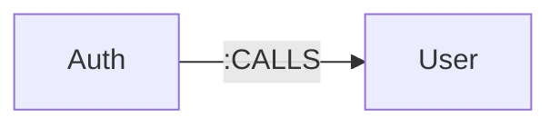
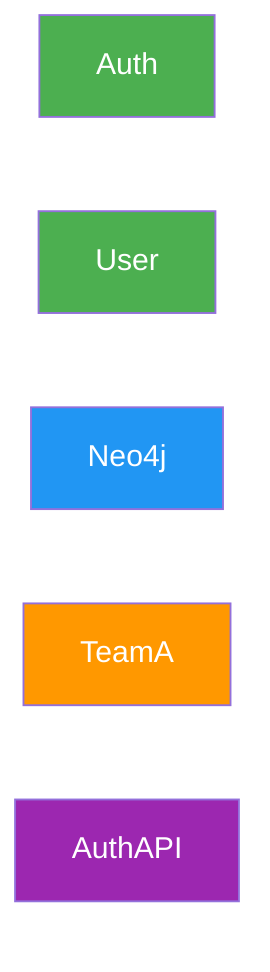
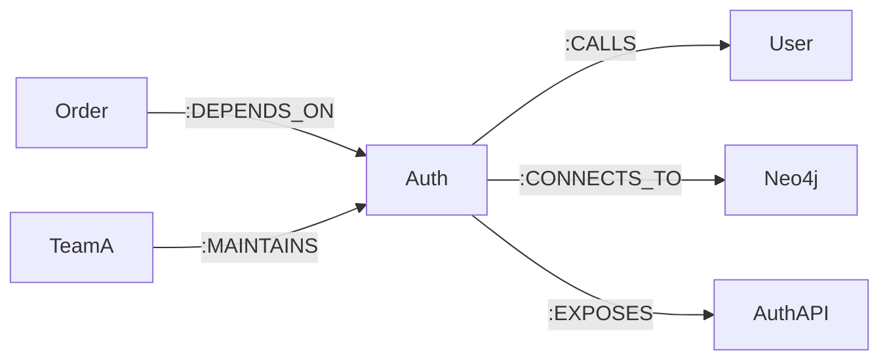
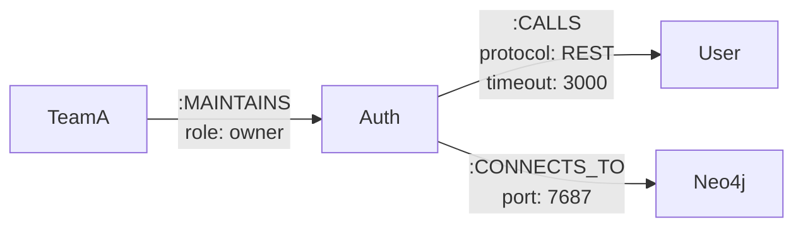
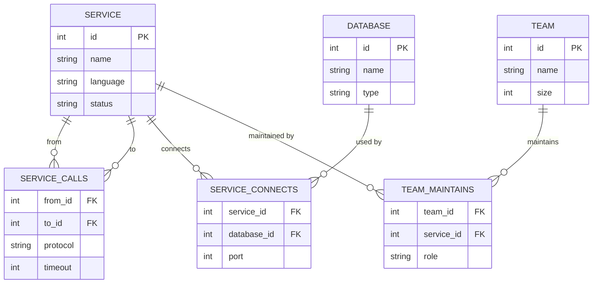
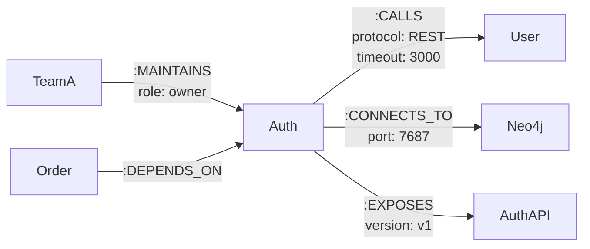

# 01_nodes-and-relationships.md
🟢 Базовый уровень

---

## Содержание
- (#что-такое-граф)
- (#узлы--nodes)
- (#связи--relationships)
- (#свойства--properties)
- (#граф-модель-vs-sql-схема)
- (#типичные-ошибки)
- (#советы-аналитику)

---

## Что такое граф?

Граф — это структура данных состоящая из
**узлов (nodes)** и **связей (relationships)**.
В отличие от реляционных БД где данные хранятся
в таблицах и связываются через JOIN,
в Neo4j связи являются объектами первого класса —
они хранятся физически вместе с узлами.

### 🟢 Базовая граф-модель сквозного кейса


> На диаграмме: два микросервиса связанные
> отношением CALLS (вызывает).
> Это минимальная модель — узлы и одна связь
> без дополнительных свойств.

---

## Узлы — Nodes

Узел — это основная единица данных в Neo4j.
Аналог строки в таблице реляционной БД.
Каждый узел имеет **метку (Label)**
которая определяет его тип.

### Сравнение с SQL

| Концепция | SQL | Neo4j |
|:---|:---|:---|
| Контейнер данных | Таблица `services` | Метка `:Service` |
| Единица данных | Строка в таблице | Узел (Node) |
| Тип записи | Имя таблицы | Label узла |
| Уникальный ID | `PRIMARY KEY` | Внутренний ID Neo4j |
| Несколько типов | Несколько таблиц | Несколько Labels на узле |

### Пример кода

```cypher
// Create a service node with label :Service
// Создаём узел микросервиса с меткой :Service
CREATE (auth:Service {name: "AuthService"})

// A node can have multiple labels
// Узел может иметь несколько меток одновременно
CREATE (auth:Service:Backend {name: "AuthService"})

// Find all nodes with label :Service
// Находим все узлы с меткой :Service
MATCH (s:Service)
RETURN s.name
```

### 🟢 Диаграмма: все типы узлов сквозного кейса


> На диаграмме: четыре типа узлов системы.
> Цвета обозначают типы:
> 🟢 Service | 🔵 Database | 🟠 Team | 🟣 API

---

## Связи — Relationships

Связь — это именованное направленное
соединение между двумя узлами.
В отличие от Foreign Key в SQL,
связь в Neo4j хранит данные
и имеет направление.

### Сравнение с SQL

| Концепция | SQL | Neo4j |
|:---|:---|:---|
| Связь между таблицами | `FOREIGN KEY` + `JOIN` | `Relationship` |
| Данные связи | Промежуточная таблица | Properties связи |
| Направление | Не определено | Всегда направленная |
| Именование | Имя таблицы | Тип связи `` |
| Поиск по связи | `JOIN` (дорого) | По указателю (быстро) |

### Пример кода

```cypher
// Create relationship between two services
// Создаём связь CALLS между двумя сервисами
MATCH (auth:Service {name: "AuthService"})
MATCH (user:Service {name: "UserService"})
CREATE (auth)-->(user)

// Find all services that AuthService calls
// Находим все сервисы которые вызывает AuthService
MATCH (auth:Service {name: "AuthService"})
      -->
      (called:Service)
RETURN called.name
```

### 🟢 Диаграмма: все типы связей сквозного кейса


> На диаграмме: полная карта связей системы.
> Каждый тип связи отражает реальное
> взаимодействие между компонентами системы:
> - CALLS — синхронный вызов сервиса
> - DEPENDS_ON — зависимость при запуске
> - CONNECTS_TO — подключение к базе данных
> - EXPOSES — публикация API
> - MAINTAINS — ответственность команды

---

## Свойства — Properties

Свойства — это пары ключ-значение
которые можно добавить к узлу или связи.
Аналог колонок в таблице SQL,
но в отличие от SQL свойства
не требуют фиксированной схемы.

### Сравнение с SQL

| Концепция | SQL | Neo4j |
|:---|:---|:---|
| Хранение данных | Колонки таблицы | Properties узла/связи |
| Схема | Фиксированная | Гибкая (schemaless) |
| Обязательность | `NOT NULL` | Опциональные |
| Типы данных | Строгие типы | Динамические типы |
| Properties связи | Промежуточная таблица | Прямо на связи |

### Пример кода

```cypher
// Create node with properties
// Создаём узел с набором свойств
CREATE (auth:Service {
    name: "AuthService",       // service name
    language: "Python",        // programming language
    version: "1.0.0",          // current version
    status: "active"           // service status
})

// Create relationship with properties
// Создаём связь со свойствами
MATCH (auth:Service {name: "AuthService"})
MATCH (user:Service {name: "UserService"})
CREATE (auth)-->(user)
```

### 🟢 Диаграмма: узлы и связи с properties


> На диаграмме: граф-модель с properties.
> Каждый узел и связь содержат
> ключевые свойства системы микросервисов.

---

## Граф-модель vs SQL схема

### SQL схема системы микросервисов


> SQL схема: 6 таблиц, 3 промежуточные таблицы
> для хранения связей с properties

### Neo4j граф-модель той же системы


> Neo4j модель: 5 узлов, 5 связей с properties.
> Промежуточные таблицы не нужны —
> связи хранят данные напрямую.

---

## Типичные ошибки

### Простые ошибки

| ❌ Ошибка | ✅ Правильно | 💬 Пояснение |
|:---|:---|:---|
| Метка узла строчными буквами `:service` | `:Service` | Labels пишутся с заглавной буквы |
| Тип связи строчными буквами `:calls` | `:CALLS` | Relationships пишутся ЗАГЛАВНЫМИ |
| Поиск без метки `MATCH (n)` | `MATCH (n:Service)` | Без метки Neo4j сканирует все узлы |
| Связь без направления `(a)--(b)` | `(a)-->(b)` | Всегда указывай направление связи |

### Сложные ошибки

```cypher
// ❌ WRONG: creating node without label
// Проблема: узел без метки невозможно
// эффективно найти — нет индексации по типу
CREATE (s {name: "AuthService"})

// ✅ CORRECT: always use labels
// Метка обязательна для эффективного поиска
CREATE (s:Service {name: "AuthService"})

---

// ❌ WRONG: storing relationships as properties
// Проблема: связи как свойства — антипаттерн Neo4j
// теряем всю мощь графовых запросов
CREATE (s:Service {
    name: "AuthService",
    calls:  // ❌ антипаттерн!
})

// ✅ CORRECT: use real relationships
// Связи должны быть настоящими Relationships
MATCH (auth:Service {name: "AuthService"})
MATCH (user:Service {name: "UserService"})
CREATE (auth)-->(user)
```

---

## Советы аналитику

💡 **Думай связями, а не таблицами** —
если в SQL ты используешь JOIN,
в Neo4j это должна быть Relationship

⚠️ **Никогда не храни связи как массивы** —
`calls: ` это антипаттерн,
используй настоящие Relationships

🔑 **Метки — это типы узлов** —
`:Service`, `:Database`, `:Team`
работают как имена таблиц в SQL

```cypher
// Best practice: naming conventions
// Соглашения об именовании в Neo4j

// Labels — CamelCase с заглавной буквы
:Service      // ✅
:DataBase     // ✅
:service      // ❌
:data_base    // ❌

// Relationships — UPPER_SNAKE_CASE
:CALLS        // ✅
:DEPENDS_ON   // ✅
:calls        // ❌
:dependsOn    // ❌

// Properties — camelCase
name          // ✅
createdAt     // ✅
Name          // ❌
created_at    // ❌
```

---